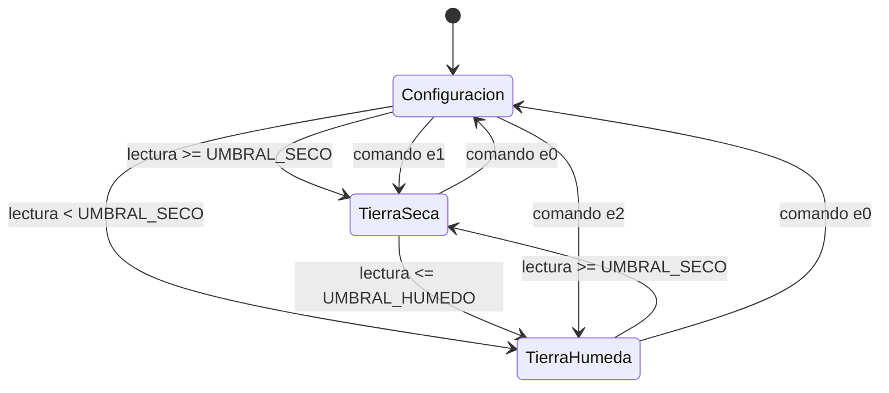
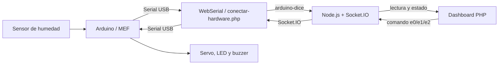

# Diagramas del sistema

## Máquina de estados finitos

```mermaid
stateDiagram-v2
    [*] --> Configuracion
    Configuracion --> TierraSeca: lectura >= UMBRAL_SECO
    Configuracion --> TierraHumeda: lectura < UMBRAL_SECO
    TierraSeca --> TierraHumeda: lectura <= UMBRAL_HUMEDO
    TierraHumeda --> TierraSeca: lectura >= UMBRAL_SECO
    TierraSeca --> Configuracion: comando e0
    TierraHumeda --> Configuracion: comando e0
    Configuracion --> TierraSeca: comando e1
    Configuracion --> TierraHumeda: comando e2
```

## Flujo de información

```mermaid
flowchart LR
    S[Sensor de humedad] --> A[Arduino / MEF]
    A -->|Serial USB| W[WebSerial / conectar-hardware.php]
    W -->|arduino-dice| N[Node.js + Socket.IO]
    N -->|lectura y estado| D[Dashboard PHP]
    D -->|comando e0/e1/e2| N
    N -->|Socket.IO| W
    W -->|Serial USB| A
    A --> X[Servo, LED y buzzer]
```

Los diagramas Mermaid pueden visualizarse directamente en GitHub.
